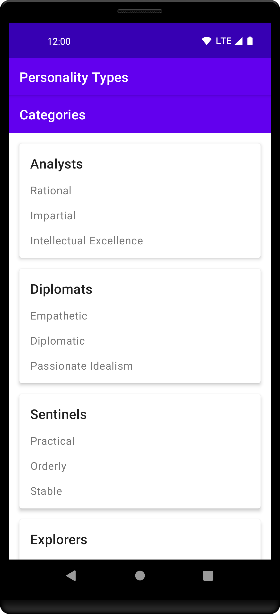

# Personality Types

## Description

Personality Types is a modified version of the Sports app from Unit 3 (Navigation) of
[Android Basics in Kotlin course](https://developer.android.com/codelabs/basic-android-kotlin-training-adaptive-layouts).

- It is an adaptation of the Sports app for displaying
[Myers-Briggs Personality Types](https://www.myersbriggs.org/my-mbti-personality-type/mbti-basics/the-16-mbti-types.htm).
- Android app

## Screenshots

